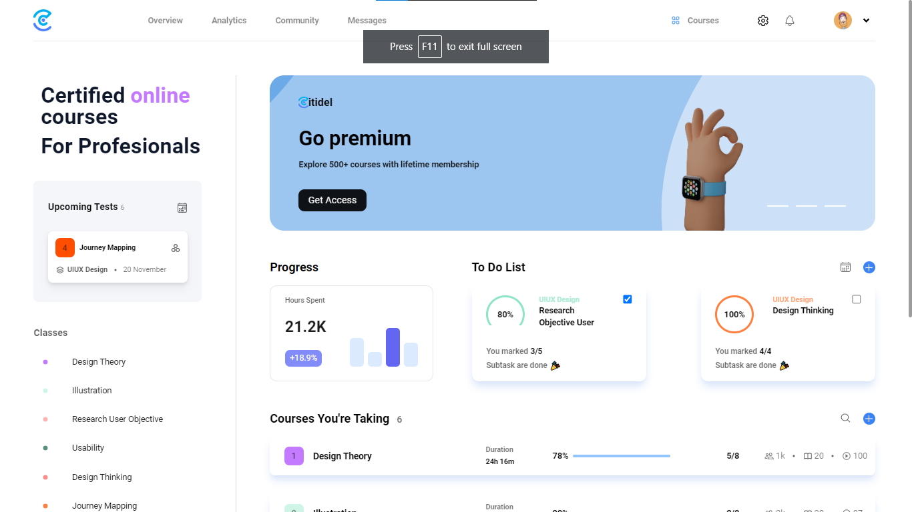

# Tech Citidel Interview Project

This project was bootstrapped with Webpack

## Welcome! 👋

In the project directory, you can run:

### `npm start`

Runs the app in the development mode.\
Open [http://localhost:3030](http://localhost:3030) to view it in your browser.

### `json-server --watch db.json`

Initializes a mock-api route for redux-saga data fetching.\
Open [http://localhost:3000/courses](http://localhost:3030/courses) to view it in your browser.

### `npm run build`

Builds the app for production to the `build` folder.\
It correctly bundles React in production mode and optimizes the build for the best performance.

## Built With
* *React*
* *PostCss*
* *Tailwind*
* *Redux*
* *Redux-Saga*
* *Redux-toolkit*
* *Webpack*
